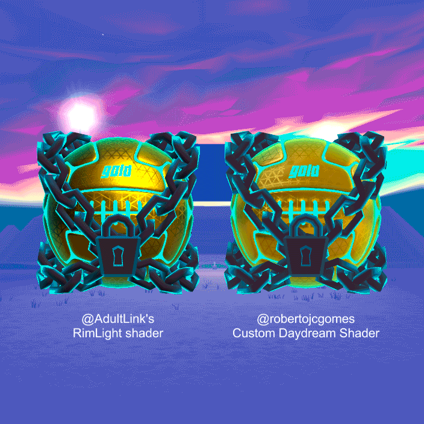

# CustomDaydreamRenderer    

## Description
Customized Daydream Renderer Shaders with Emission and Rim Light.
## Aknowlegements
This customizations were frankensteined to the best of my sparse shader knowlege from @AdultLink's RimLight shader: https://github.com/AdultLink/Rimlight/blob/master/Assets/AdultLink/Rimlight/Rimlight.shader
## Installation
Simply import the unitypackage into a new project or just download the files into an existing Daydream project.
